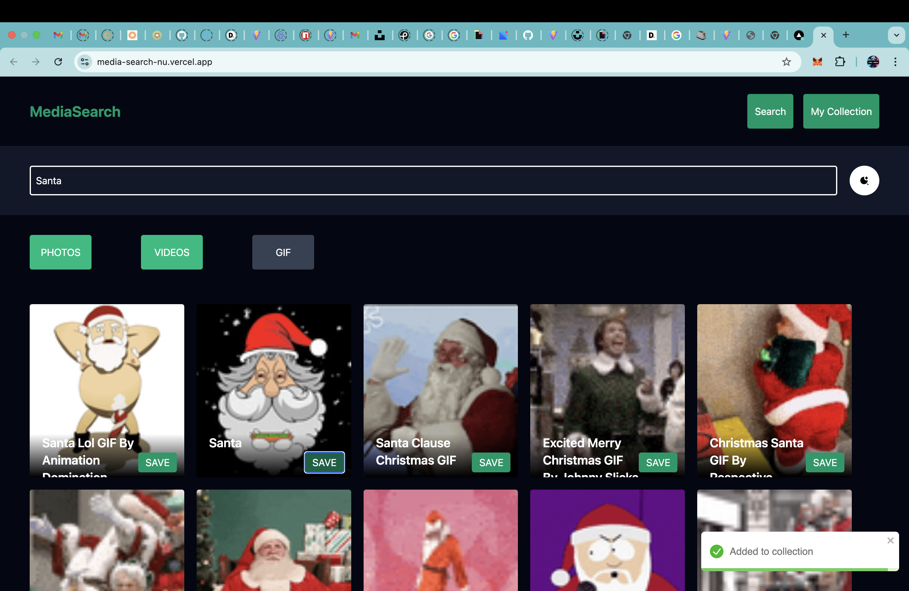

# 🔎 MediaSearch

MediaSearch is a React application built to explore and understand Redux Toolkit concepts while creating a real-world media search experience. Users can search for any topic and browse Photos, Videos, or GIFs using external APIs. Users can also save their favorite media items to a personal collection and manage them easily.

---

## 🚀 Features

- 🔍 Search media by keyword or topic
- 🖼️ Browse Photos, Videos, and GIFs
- 🔄 Dynamic tab switching between media types
- ❤️ Save favorite media to My Collection
- ❌ Remove individual items from collection
- 🧹 Clear entire collection
- 🔗 Open media in original source page
- 🔔 Toast notifications for actions
- ⚡ Fast UI with Tailwind CSS

---

## 🧠 What I Learned

This project was built mainly to understand core frontend concepts:

- Redux Toolkit (Slice, Store, Dispatch, Selector)
- React Router DOM
- API Integration
- State Management
- Component Architecture
- Tailwind CSS styling
- Toast notifications
- Handling async operations
- Error and loading states

---

## 🛠️ Tech Stack

- React
- Redux Toolkit
- React Router DOM
- Tailwind CSS
- Axios / Fetch API
- React Toastify

---

## 🌐 APIs Used

- Unsplash API → Photos
- Pexels API → Videos
- Giphy API → GIFs

---

## 📸 Screenshots

### 🏠 Search Page





### ❤️ My Collection


---

## ⚙️ Installation

Clone the repository

```
git clone https://github.com/yourusername/mediasearch.git
```

Navigate into project folder

```
cd mediasearch
```

Install dependencies

```
npm install
```

Run the project

```
npm run dev
```

---

## 🔑 Environment Variables

Create a `.env` file in the root directory and add your API keys:

```
VITE_UNSPLASH_KEY=your_key_here
VITE_PEXELS_KEY=your_key_here
VITE_GIPHY_KEY=your_key_here
```

---


